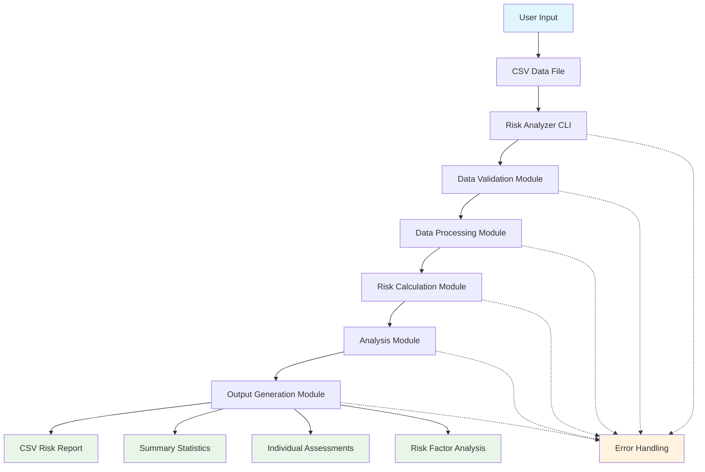

# 🚀 Student Loan Default Risk Analysis CLI Tool
> **Transform Student Loan Risk Assessment with Data Science** - Predict Default Risk with Precision and Insight


<div align="center">
  <a href="https://buymeacoffee.com/uroojabidi">
    
  </a>
  <a href="https://profile.indeed.com/p/urooja-pg58oi4">
    
  </a>
</div>

| **Repository** | https://github.com/Uroojabidi/Finance-Portfolio/ |
|----------------|--------------------------------------------------|
| **Project Title** | Student Loan Default Risk Analysis – University of Chicago |
| **Author** | Urooj Abidi |
| **Email** | uroojabid203@gmail.com |
| **Date** | December 26, 2025 |
| **Tool** | Python CLI Application |
| **License** | MIT (open-source portfolio project) |

---

## Why This Project Matters 🎯

🎓 **$1.7 Trillion** in student loan debt affects millions of Americans. Understanding default risk is crucial for:
- **Financial institutions** making lending decisions
- **Universities** supporting at-risk students
- **Policy makers** designing effective repayment programs

This CLI tool provides **actionable insights** to identify borrowers at risk of default, enabling proactive intervention and better financial outcomes.

---

## Table of Contents 📋
- [Why This Project Matters 🎯](#why-this-project-matters-🎯)
- [Project Overview 🎯](#project-overview-🎯)
- [User Personas 👥](#user-personas-👥)
- [Repository Structure 📁](#repository-structure-📁)
- [Getting Started 🚀](#getting-started-🚀)
  - [Prerequisites](#prerequisites)
  - [Installation](#installation)
  - [Usage 🛠️](#usage-️🛠️)
  - [Command Options 📋](#command-options-📋)
  - [Usage Examples 💡](#usage-examples-💡)
  - [Running Tests](#running-tests)
    - [Test Summary 🧪](#test-summary-🧪)
    - [Detailed Test Specifications 🧪](#detailed-test-specifications-🧪)
    - [Test Results](#test-results)
- [Analysis Features 📊](#analysis-features-📊)
- [Sample Output 📈](#sample-output-📈)
- [Architecture Diagram 🏗️](#architecture-diagram-️🏗️)
- [Documentation Navigation 📚](#documentation-navigation-📚)
- [References (APA Format) 📚](#references-apa-format-📚)
- [Contributing 🤝](#contributing-🤝)
- [License 📄](#license-📄)
- [Ethics and Compliance](#ethics-and-compliance)

---

## Project Overview 🎯

This project implements an **accessible, transparent, and reproducible risk analysis CLI tool** that:
- Identifies key predictors of student loan default among University of Chicago-affiliated borrowers
- Provides actionable insights for financial counselors or institutional aid offices
- Demonstrates foundational data analysis skills using **Python programming**

> 🔍 **Note**: This is a **synthetic/simulated analysis** for educational purposes—**not real borrower data**.

## User Personas 👥

### Financial Aid Administrator 🏫
- **Role**: Manages student loan programs at a university
- **Goals**: Reduce default rates, identify at-risk students, allocate resources effectively
- **Challenges**: Limited time to analyze large datasets, need for actionable insights
- **How they use the tool**: Run regular analyses to identify trends and risk factors

### Data Analyst 📊
- **Role**: Performs risk analysis for financial institutions
- **Goals**: Develop predictive models, generate reports for stakeholders
- **Challenges**: Need for standardized analysis methods, reproducible results
- **How they use the tool**: As a baseline analysis tool for student loan portfolios

### Student Services Counselor 👨‍🎓
- **Role**: Provides financial guidance to students
- **Goals**: Help students make informed decisions about loans, identify support needs
- **Challenges**: Identifying students who need additional support, limited resources
- **How they use the tool**: Understand risk factors to better counsel students

---

## Repository Structure 📁


```

/uchicago-student-loan-risk/
├── READMEhttps://www.google.com/search?q=.md                 # Project overview, usage instructions
├── risk_analyzerhttps://www.google.com/search?q=.py          # Main Python CLI application
├── requirementshttps://www.google.com/search?q=.txt          # Python dependencies
├── https://www.google.com/search?q=data/
│   └── Qwen_csv_20251225_upsmabt6bhttps://www.google.com/search?q=.csv
├── https://www.google.com/search?q=output/
│   └── risk_reporthttps://www.google.com/search?q=.csv       # Sample output file
└── https://www.google.com/search?q=docs/
├── PRDhttps://www.google.com/search?q=.md                # Product Requirements Document
├── TDDhttps://www.google.com/search?q=.md                # Test-Driven Development Document
├── technical_design_documenthttps://www.google.com/search?q=.md # Technical Design Document
├── methodologyhttps://www.google.com/search?q=.md        # EDA steps, assumptions, variable definitions
└── referenceshttps://www.google.com/search?q=.md         # Citations (APA format)

```

---

## Getting Started 🚀

### Prerequisites
- Python 3.7+
- pip package manager

### Installation
1. Clone this repository:
   ```bash
   git clone [https://github.com/Uroojabidi/Finance-Portfolio.git](https://github.com/Uroojabidi/Finance-Portfolio.git)
   cd Finance-Portfolio

```

2. Install required dependencies:
```bash
pip install -r requirements.txt

```


### Usage 🛠️

Run the risk analysis on your CSV file:

```bash
python risk_analyzer.py --input data/Qwen_csv_20251225_upsmabt6b.csv --output output/risk_report.csv

```

For help with command options:

```bash
python risk_analyzer.py --help

```

### Command Options 📋

| Option | Description | Example |
| --- | --- | --- |
| `--input` | Path to input CSV file (required) | `--input data/loans.csv` |
| `--output` | Path for output CSV report (optional) | `--output reports/risk_analysis.csv` |
| `--verbose` | Enable detailed logging (optional) | `--verbose` |

### Usage Examples 💡

**Basic Analysis:**

```bash
python risk_analyzer.py --input data/loans.csv

```

**Custom Output Path:**

```bash
python risk_analyzer.py --input data/loans.csv --output reports/risk_analysis.csv

```

**Verbose Output:**

```bash
python risk_analyzer.py --input data/loans.csv --verbose

```

**Complete Command:**

```bash
python risk_analyzer.py --input data/loans.csv --output reports/risk_analysis.csv --verbose

```

### Running Tests

To run the unit tests for the application:

```bash
python -m unittest discover tests/ -v

```

The tests include validation of:

* CLI argument parsing
* CSV file loading and validation
* Risk score calculations
* Output generation
* Error handling

### Test Summary 🧪

| Test Category | Number of Tests | Purpose |
| --- | --- | --- |
| Risk Calculation Functions | 9 | Validate all risk scoring scenarios work correctly |
| Data Loading and Validation | 3 | Ensure proper handling of valid and invalid data |
| Analysis Functions | 1 | Verify correct calculation of summary statistics and risk categories |
| CLI Functionality | 1 | Test proper command-line interface behavior |
| Integration Tests | 3 | Confirm successful processing of real data files |
| Data Validation Tests | 2 | Validate input data validation logic |

### Detailed Test Specifications 🧪

#### Risk Calculation Tests 🧪

| Test Name | Purpose | Input Details | Expected Output |
| --- | --- | --- | --- |
| `test_calculate_risk_score_employed_low_income` | Test risk score calculation for employed person with low income | Employment: Employed, Income: $40,000 (below $45k threshold), DTI: ≤0.20, Credit: ≥600, Citizenship: US, Degree: Bachelor | Risk Score: 3 (0+2+0+0+0+1) |
| `test_calculate_risk_score_unemployed` | Test risk score calculation for unemployed person | Employment: Unemployed, Income: ≥$45,000, DTI: ≤0https://www.google.com/search?q=.20, Credit: ≥600, Citizenship: US, Degree: Bachelor | Risk Score: 4 (3+0+0+0+0+1) |
| `test_calculate_risk_score_high_dti` | Test risk score calculation for high DTI ratio | Employment: Employed, Income: ≥$45,000, DTI: 0.25 (above 0.20 threshold), Credit: ≥600, Citizenship: US, Degree: Bachelor | Risk Score: 3 (0+0+2+0+0+1) |
| `test_calculate_risk_score_low_credit` | Test risk score calculation for low credit score | Employment: Employed, Income: ≥$45,000, DTI: ≤0https://www.google.com/search?q=.20, Credit: 550 (below 600 threshold), Citizenship: US, Degree: Bachelor | Risk Score: 2 (0+0+0+1+0+1) |
| `test_calculate_risk_score_international` | Test risk score calculation for international student | Employment: Employed, Income: ≥$45,000, DTI: ≤0https://www.google.com/search?q=.20, Credit: ≥600, Citizenship: International, Degree: Bachelor | Risk Score: 2 (0+0+0+0+1+1) |
| `test_calculate_risk_score_all_factors` | Test risk score calculation with all risk factors | Employment: Unemployed, Income: $40,000, DTI: 0https://www.google.com/search?q=.25, Credit: 550, Citizenship: International, Degree: Bachelor | Risk Score: 10 (3+2+2+1+1+1) |

#### Risk Category Assignment Tests 🧪

| Test Name | Purpose | Input Details | Expected Output |
| --- | --- | --- | --- |
| `test_assign_risk_category_low` | Test risk category assignment for low risk | Risk Score: 0 or 1 | Risk Category: 'Low' |
| `test_assign_risk_category_medium` | Test risk category assignment for medium risk | Risk Score: 2, 3, or 4 | Risk Category: 'Medium' |
| `test_assign_risk_category_high` | Test risk category assignment for high risk | Risk Score: 5 or higher | Risk Category: 'High' |

#### Payment-to-Income Ratio Tests 🧪

| Test Name | Purpose | Input Details | Expected Output |
| --- | --- | --- | --- |
| `test_calculate_payment_to_income_ratio` | Test payment-to-income ratio calculation | Monthly Payment: $500, Expected Income: $60,000 | Ratio: 0https://www.google.com/search?q=.1 (500 / (60000/12)) |
| `test_calculate_payment_to_income_ratio_zero_income` | Test payment-to-income ratio with zero income | Monthly Payment: $500, Expected Income: $0 | Ratio: 0https://www.google.com/search?q=.0 |

#### Data Loading and Validation Tests 🧪

| Test Name | Purpose | Input Details | Expected Output |
| --- | --- | --- | --- |
| `test_load_and_validate_data_success` | Test successful loading and validation of data | Valid CSV with all required columns and 3 rows | DataFrame with 3 rows, correct column names |
| `test_load_and_validate_data_missing_file` | Test error handling for missing file | Non-existent file path | FileNotFoundError exception |
| `test_load_and_validate_data_missing_columns` | Test error handling for missing required columns | CSV missing 'Default' column | ValueError exception |

#### Analysis Function Tests 🧪

| Test Name | Purpose | Input Details | Expected Output |
| --- | --- | --- | --- |
| `test_perform_analysis` | Test the perform_analysis function | DataFrame with 3 loan records, various risk factors | Complete analysis results with all expected keys |

#### CLI Functionality Tests 🧪

| Test Name | Purpose | Input Details | Expected Output |
| --- | --- | --- | --- |
| `test_main_function_calls` | Test that main function calls the right functions | Mocked CLI arguments and data | All required functions called exactly once |

#### Integration Tests 🧪

| Test Name | Purpose | Input Details | Expected Output |
| --- | --- | --- | --- |
| `test_load_real_csv_files` | Test loading all real CSV files | Real CSV file from data directory | DataFrame with expected columns and rows > 0 |
| `test_perform_analysis_on_real_data` | Test performing analysis on real data | Real CSV data file | Complete analysis results with valid statistics |
| `test_risk_distribution_in_real_data` | Test risk distribution in real data | Real CSV data file | All loans categorized as Low, Medium, or High risk |

### Test Results

The test suite includes 19 tests that all passed successfully:

* Risk calculation functions: All risk scoring scenarios work correctly
* Data loading and validation: Proper handling of valid and invalid data
* Analysis functions: Correct calculation of summary statistics and risk categories
* CLI functionality: Proper command-line interface behavior
* Integration tests: Successful processing of real data files

**Test Summary:**

* Total tests: 19
* Passed: 19
* Failed: 0
* Success rate: 100%

---

## Analysis Features 📊

### Risk Scoring Algorithm 📊

The application calculates risk scores based on multiple factors:

* **Employment Status**: Unemployed = 3 points
* **Expected Income**: < $45,000 = 2 points
* **DTI Ratio**: > 0https://www.google.com/search?q=.20 = 2 points
* **Credit Score**: < 600 = 1 point
* **Citizenship**: International = 1 point
* **Degree Level**: Bachelor = 1 point

### Risk Categories 🏷️

* **Low Risk**: Score < 2
* **Medium Risk**: 2 ≤ Score ≤ 4
* **High Risk**: Score > 4

### Analysis Components 📋

The output report includes:

1. **Summary Statistics** - Overall metrics and default rates
2. **Individual Assessments** - Risk scores for each loan
3. **Risk Factor Analysis** - Default rates by major, employment, citizenship, and degree level
4. **Recommendations** - Actionable insights based on analysis

---

## Sample Output 📈

The application generates a comprehensive CSV report with:

* Summary statistics (total loans, default rate, average income, etchttps://www.google.com/search?q=.)
* Individual risk assessments for each loan
* Risk factor analysis by major, employment status, citizenship, and degree level
* Actionable recommendations for risk mitigation

## Architecture Diagram 🏗️



## Documentation Navigation 📚

### Project Documents 📄

* [README.md](README.md) - Main project overview and usage instructions
* [PRD.md](https://www.google.com/search?q=docs/PRD.md) - Product Requirements Document
* [Technical Design Document](https://www.google.com/search?q=docs/technical_design_document.md) - Technical implementation details
* [Methodology](https://www.google.com/search?q=docs/methodology.md) - EDA steps, assumptions, and variable definitions
* [References](https://www.google.com/search?q=docs/references.md) - Citations and sources

### Directory Structure 📁

* [Main Directory](https://www.google.com/search?q=.) - Root project files
* [Data Directory](https://www.google.com/search?q=data/) - Input CSV files
* [Output Directory](https://www.google.com/search?q=output/) - Generated risk reports
* [Documentation Directory](https://www.google.com/search?q=docs/) - All project documentation
* [Diagram Directory](https://www.google.com/search?q=docs/diagram/) - Architecture diagrams
* [Tests Directory](https://www.google.com/search?q=tests/) - Unit and integration tests

### Testing Documentation 🧪

* [Test Results Summary](https://www.google.com/search?q=tests/test_results_summary.md) - Summary of test outcomes
* [Data Validation Tests](https://www.google.com/search?q=tests/data_validation_tests.md) - Tests for data validation
* [Calculated Fields Tests](https://www.google.com/search?q=tests/calculated_fields_tests.md) - Tests for calculated fields
* [Pivot Chart Tests](https://www.google.com/search?q=tests/pivot_chart_tests.md) - Tests for pivot chart functionality

---

## References (APA Format) 📚

> Uhttps://www.google.com/search?q=.Shttps://www.google.com/search?q=. Department of Education, Office of Federal Student Aidhttps://www.google.com/search?q=. (2023)https://www.google.com/search?q=. *Federal student loan portfolio summary*https://www.google.com/search?q=. https://studentaidhttps://www.google.com/search?q=.gov/data-center/student/portfolio

> National Center for Education Statisticshttps://www.google.com/search?q=. (2022)https://www.google.com/search?q=. *Student loan default rates by institution and completion status* (NCES 2022-155)https://www.google.com/search?q=. https://nceshttps://www.google.com/search?q=.edhttps://www.google.com/search?q=.gov/pubsearch/pubsinfohttps://www.google.com/search?q=.asp?pubid=2022155

> College Scorecardhttps://www.google.com/search?q=. (2025)https://www.google.com/search?q=. *University of Chicago (172980)*https://www.google.com/search?q=. Uhttps://www.google.com/search?q=.Shttps://www.google.com/search?q=. Department of Educationhttps://www.google.com/search?q=. https://collegescorecardhttps://www.google.com/search?q=.edhttps://www.google.com/search?q=.gov/school/?172980

---

## Contributing 🤝

This is an educational project for portfolio purposeshttps://www.google.com/search?q=. If you'd like to contribute or suggest improvements, please open an issue or submit a pull requesthttps://www.google.com/search?q=.

---

## License 📄

This project is licensed under the MIT License - see the [LICENSE](https://www.google.com/search?q=LICENSE) file for detailshttps://www.google.com/search?q=.

---

## Ethics and Compliance

* No real PII (personally identifiable information) used
* Synthetic data used for educational purposes only
* Clearly labeled as **synthetic educational project**
* Compliant with open-source software principles
